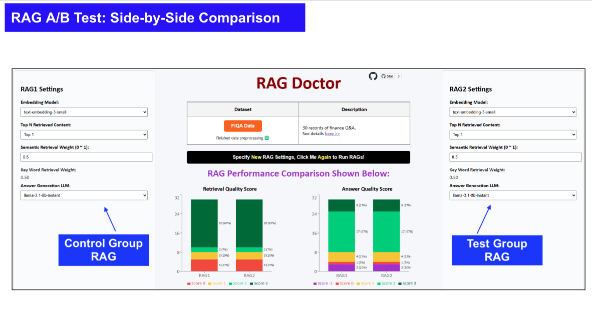

# RAG Doctor - The Missing Evaluation Layer for Production RAG

## The Challenges
* Most teams don't fail at building RAG. They fail at <b>making it reliable</b>.
* To move fast, teams adopt auto evaluation. But when results actually matter,
they fall back to manual inspection: <b>slow, costly, and inconsistent</b>.

## What RAG Doctor Does
* ⚡RAG Doctor reduces up to 90% of manual evaluation, compare RAG versions in minutes (not days).
* 🔍 Pinpoint root causes across the pipeline, from knowledge base to retrieval, prompting, and outputs.
* 📈 Turn evaluation into a fast, iterative loop

  

👉 [Try the Playground >>][2]

## Why This Matters
* Built from experience running production RAG systems where evaluation became the bottleneck.
* We believe: Auto Evaluation + Root Cause Analysis will become the foundation of production AI.
* RAG Doctor is the first step toward:
  * automated knowledge base optimization
  * auto-generated golden datasets
  * self-improving RAG systems

## 🚀 Roadmap (what we're building next)
- [ ] Iterative improvement loop
- [ ] More precise root cause analysis
- [ ] Automatic golden dataset generation and update
- [ ] Automatic knowledge base selection
 

## 🤝 Join Us
This is not just a tool, it helps shape the reliability of future AI products.

We're looking for people who:
* care about making AI actually reliable
* want to shape an emerging standard

Ways to contribute:
* Try it on your RAG system and share feedback
* Contribute to system design and development
* Contribute to core algorithms

👉 [Project Setup Guide][1]

[1]:https://github.com/hanhanwu/RagDoctor/blob/main/developer_readme.md
[2]:https://rag-dr.hanhanwu.com/

